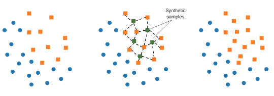

# Credit Card Fraud Detection

**Context:** It is important that credit card companies are able to recognize fraudulent credit card transactions so that customers are not charged for items that they did not purchase.

**Content:** The dataset contains transactions made by credit cards in September 2013 by european cardholders. This dataset presents transactions that occurred in two days, where we have 492 frauds out of 284,807 transactions. The dataset is highly unbalanced, the positive class (frauds) account for 0.172% of all transactions.

It contains only numerical input variables which are the result of a PCA transformation. Unfortunately, due to confidentiality issues, the original features and more background information about the data is not provided. Features V1, V2, … V28 are the principal components obtained with PCA, the only features which have not been transformed with PCA are 'Time' and 'Amount'. Feature 'Time' contains the seconds elapsed between each transaction and the first transaction in the dataset. The feature 'Amount' is the transaction Amount, this feature can be used for example-dependant cost-senstive learning. Feature 'Class' is the response variable and it takes value 1 in case of fraud and 0 otherwise.

**Data Source:** https://www.kaggle.com/mlg-ulb/creditcardfraud/home

For building the model, we have used an Artificial Neural Network. Please use the link below for an explanation of the basics of an Artificial Neural Network:

https://github.com/MohitGoel92/Will-the-customer-leave-the-bank-

## Sampling

During the model building process, we will explore two types of sampling techniques. They are "Undersampling" and "Oversampling". For oversampling, we will use "SMOTE" sampling or "Synthetic Minority Oversampling Technique".

**Undersampling:** For example, if we had a sample of 9 people of which 3 were female and 6 were male, performing undersampling will result in us selecting the 3 females but only 3 out of the 6 males. An obvious disadvantage of this method being the loss of data.

**Oversampling:** For example, if we had a sample of 9 people of which 3 were female and 6 were male, performing oversampling will result in us selecting the 6 males and double the points for females (3 original females from the sample and 3 more using SMOTE).

## SMOTE Sampling

SMOTE (Synthetic Minority Oversampling Technique) consists of synthesising elements for the minority class, based on those that already exist. It works by randomly picking a point from the minority class and computing the K-Nearest Neighbours for this point. The synthetic points are added between the chosen point and its neighbors. The diagram below illustrates this for clarity.

**Image source:** https://www.kaggle.com/rafjaa/resampling-strategies-for-imbalanced-datasets

# Conclusion

Our model has given us an accuracy of over 99%. With this, we have an algorithm that can help predict whether a credit card transaction is fraudulent. However, the data is highly unbalanced as only 0.2% of the dataset accounts for the positive class (fraud). Taking into consideration the recall score of 79%, this indicates that around 79% of fraudulent cases were correctly detected. The precision score of 84% indicates that 14% of the transactions that were predicted to be fraudulent were actually not fruadulent. This metric may be interpreted as the extra work load the department had to deal with or the amount of customers that were unnecessarily contacted/made to worry. Depending on the nature of the company, this metrics may influence the usability of the model. 

Using the approach of undersampling, we got an accuracy of around 92-94%. However, when using the model to predict the whole dataset, we obtained a recall value of 1. This suggests that of all the fraudulent transactions that truly existed, 100% were of them were flagged by our model, resulting in zero fraudulent transactions being successful. However, the precision score of 0.002 indicates there was a huge number of false positives. This creates extra work for the department, and as the number of false positives is so high, the usability of the model using this method is questionable. 

We also used SMOTE (Synthetic Minority Oversampling Technique) which yielded different results. We achieved an accuracy of around 99%. When using the model to predict the whole dataset, just like undersampling we obtained a recall value of 1. However, a notable difference is the precision score of 0.26 which is over 140 times better than undersampling (using the exact values). This suggests that there is a high% of false positives. But, observing the confusion matrix tells us that the overall number of false positives is significantly lower. This will result in less unnecessary work for the department, potentially saving a lot of resources and cost to the business when compared to the undersampling method.
